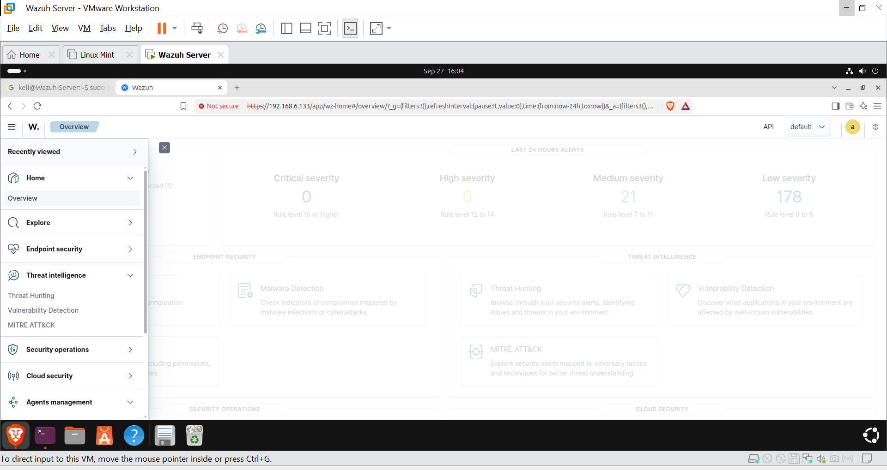
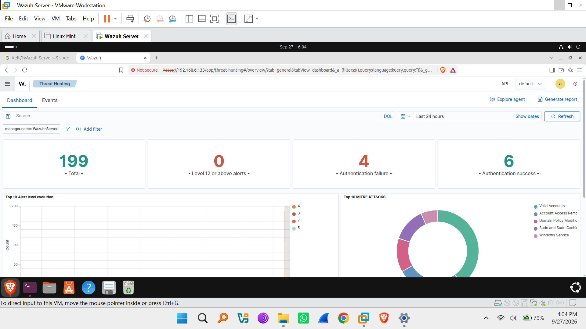
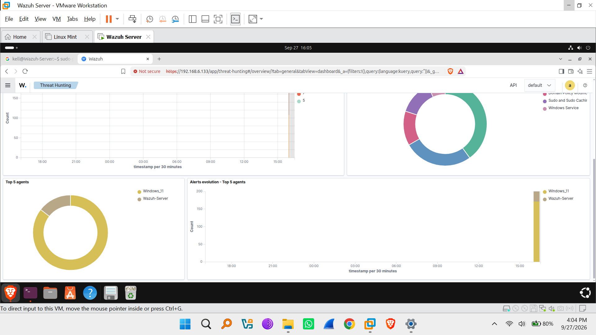
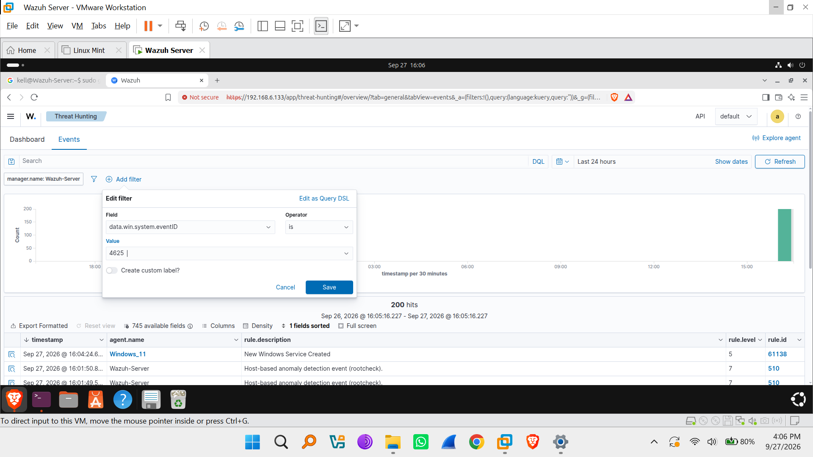
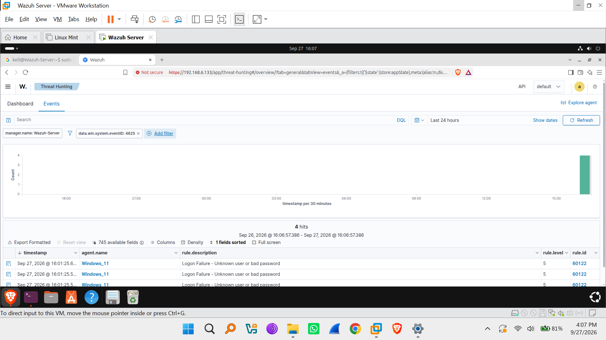
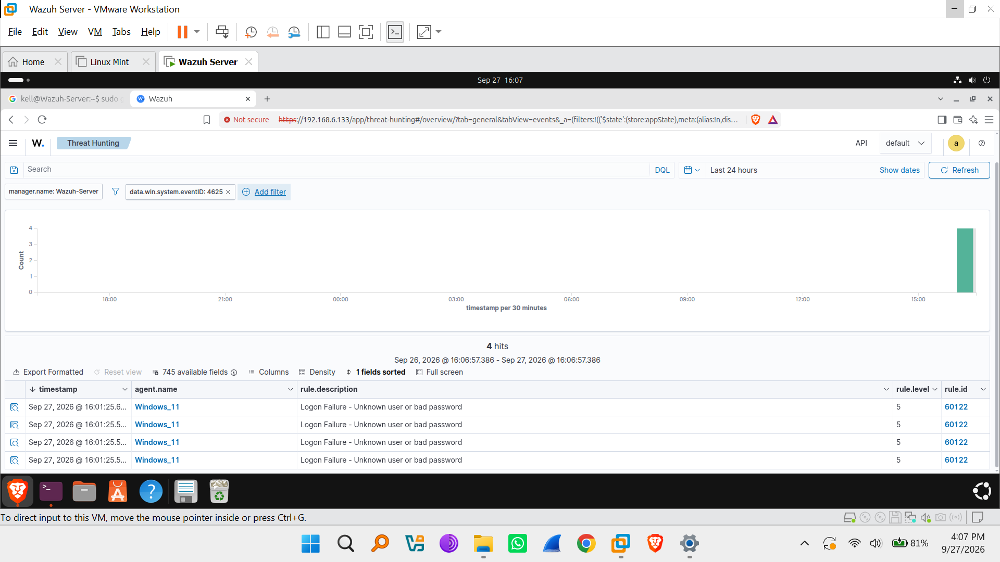
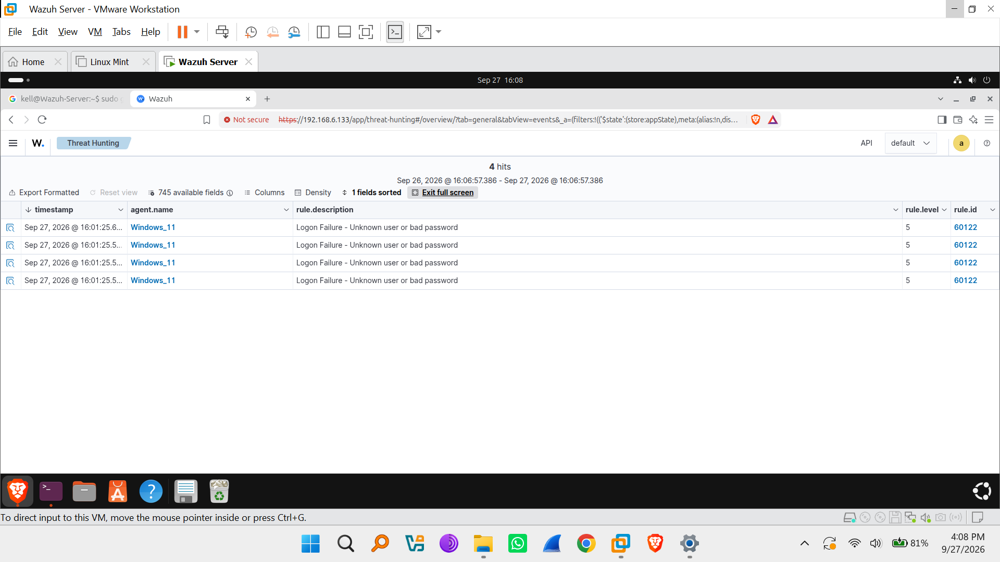
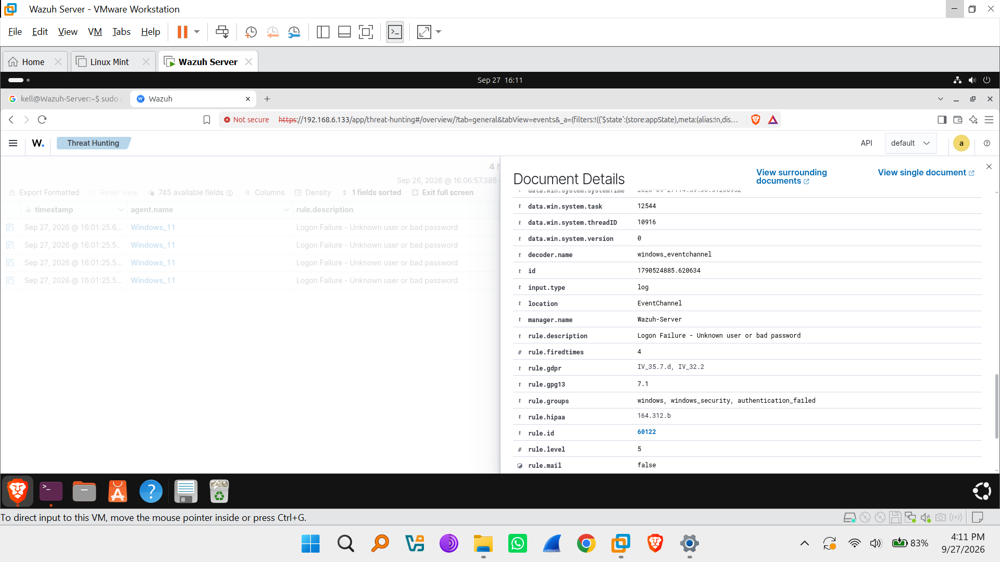

# Controlled Authentication Failure Simulation & Telemetry Investigation

**Target Environment:** Wazuh SIEM (`192.168.6.133`) monitoring `Windows_11` (Agent ID: 002)

**Date of Execution:** September 27, 2026

**Tools Used:** Wazuh Dashboard (Threat Hunting), Windows Event Viewer

---

## 1. Objective

Generate repeated, safe authentication failures against a controlled lab account at a measured pace, investigate the resulting telemetry in both Wazuh and the native Windows Event Log, count the total attempts observed by each tool, and determine whether the resulting pattern warrants escalation.

---

## 2. Methodology

### Step 1: Baseline Dashboard Review

Before generating test failures, the Wazuh Overview and Threat Hunting dashboards were reviewed to establish a baseline of existing alert volume for the prior 24 hours.

*Figure 1: Baseline severity distribution before the test.*

*Figure 2: Threat Hunting dashboard summary — 4 authentication failures already present in the last 24 hours.*

*Figure 3: Agent-level breakdown confirming Windows_11 as the dominant source of alert volume.*

### Step 2: Controlled Failed Logon Generation

Repeated incorrect-credential logon attempts were made against the local `Windows_11` (GAL1LEO) test account at a controlled, deliberate pace to simulate safe authentication failure telemetry without triggering account lockout.

### Step 3: Filtering Wazuh Events by Event ID

In the Wazuh Dashboard's Threat Hunting → Events view, a filter was added for `data.win.system.eventID: 4625` (the Windows logon failure event) to isolate the generated telemetry from other baseline noise.

*Figure 4: Constructing the Event ID 4625 filter.*

*Figure 5: Filtered result — 4 matching failed-logon events.*

*Figure 6: Full-screen confirmation of the 4 filtered events.*

*Figure 7: Final tally of 4 events within the Wazuh 24-hour filter window.*

### Step 4: Drilling into Event Details

The Document Details panel was opened on one of the filtered events to inspect the full field set for the failure.

*Figure 8: Authentication package, source IP (loopback), and process context for the failed logon.*

*Figure 9: Subject/target account fields confirming the failure was local and self-contained.*

### Step 5: Reviewing Wazuh Rule Metadata

The rule metadata for the triggering alert (rule ID `60122`) was reviewed to confirm its compliance mapping and MITRE ATT&CK classification.

*Figure 10: Full compliance and MITRE ATT&CK mapping for rule 60122.*

*Figure 11: Decoder and channel metadata confirming ingestion path.*

### Step 6: Cross-Verifying Against the Local Windows Event Log

To validate Wazuh's telemetry independently, the native Windows Event Viewer on the endpoint (GAL1LEO) was filtered for Event ID 4625 directly against the local Security log.

*Figure 12: Local Event Viewer showing 19 total Event ID 4625 entries in the full Security log.*

---

## 3. Telemetry Count Summary

| Source | Scope | Filter Applied | Count |
|---|---|---|---|
| Wazuh Dashboard | Last 24 hours | `data.win.system.eventID: 4625` (Windows_11) | 4 |
| Windows Event Viewer (local) | Full Security log (23,737 total events) | Event ID: 4625 | 19 |

**Reconciliation:** The discrepancy between Wazuh's 4-event count and the Event Viewer's 19-event count is expected — Wazuh's figure was scoped to the "Last 24 hours" dashboard window, while the local Event Viewer query covered the entire retained Security log with no time restriction. The 4 events captured by Wazuh within the last 24 hours are a subset of the full 19 recorded historically on the endpoint. All 4 Wazuh-side events were confirmed to originate from the same source (loopback IP `127.0.0.1`, workstation `GAL1LEO`, target account `GAL1LEO`), consistent with a controlled, local, self-directed test rather than a remote or distributed attempt.

---

## 4. Alert & Rule Details

| Field | Value |
|---|---|
| Rule ID | 60122 |
| Rule Description | Logon Failure - Unknown user or bad password |
| Rule Level | 5 (Medium-Low) |
| Rule Groups | windows, windows_security, authentication_failed |
| MITRE ATT&CK ID | T1531 |
| MITRE Tactic | Impact |
| MITRE Technique | Account Access Removal |
| NIST 800-53 | AU.14, AC.7 |
| PCI DSS | 10.2.4, 10.2.5 |
| HIPAA | 164.312.b |
| Authentication Package | Negotiate |
| Logon Type | 2 (Interactive) |
| Source IP | 127.0.0.1 (loopback) |
| Target Account / Workstation | GAL1LEO / GAL1LEO |
| Failure Status / SubStatus | 0xc000006d / 0xc000006a (bad username or authentication information) |

---

## 5. Escalation Determination

Based on the collected telemetry, this pattern **does not warrant escalation**, for the following reasons:

1. **Single, local source:** All failed attempts originated from the loopback address (`127.0.0.1`) on the same endpoint being tested (`GAL1LEO`), not from an external or unfamiliar host — ruling out a remote brute-force attempt.
2. **Low volume, controlled pace:** 4 failures within the monitored window (19 across the full local log history) is consistent with a small number of deliberate, spaced-out test attempts rather than an automated password-spray or brute-force pattern, which typically produces dozens to hundreds of attempts in rapid succession.
3. **No successful compromise:** No corresponding successful authentication event (Event ID 4624) followed the failures for an unexpected account, and no lockout or privilege change occurred.
4. **Rule severity is Medium-Low:** Rule 60122 fired at Level 5, well below Wazuh's Level 12+ threshold used to flag high-priority alerts on this dashboard.
5. **Known, expected activity:** The attempts were generated intentionally as part of this lab exercise, with full attribution back to the lab operator and test account.

**Recommendation:** Log this activity as expected test telemetry and take no incident-response action. In a production environment, however, the same rule (60122) firing repeatedly against a *non-local* source IP, at high frequency, or against multiple distinct accounts, would warrant escalation to investigate for brute-force or credential-stuffing activity — this exercise successfully validates that Wazuh's detection and MITRE mapping for that scenario (T1531 / Account Access Removal under the Impact tactic) is correctly configured and would trigger as expected.

---

## 6. Conclusion

1. **Detection Validated:** Wazuh correctly captured, decoded, and classified all controlled authentication failures via rule 60122, with full compliance mapping (PCI DSS, HIPAA, NIST 800-53) and MITRE ATT&CK attribution.
2. **Cross-Tool Verification:** Comparing Wazuh's windowed count (4) against the Windows Event Viewer's full-log count (19) confirmed that Wazuh's telemetry is a correctly time-scoped subset of the endpoint's actual authentication failure history, validating the ingestion pipeline.
3. **No Escalation Required:** The pattern reflects safe, self-directed lab testing rather than malicious activity, and was closed out as expected telemetry.
